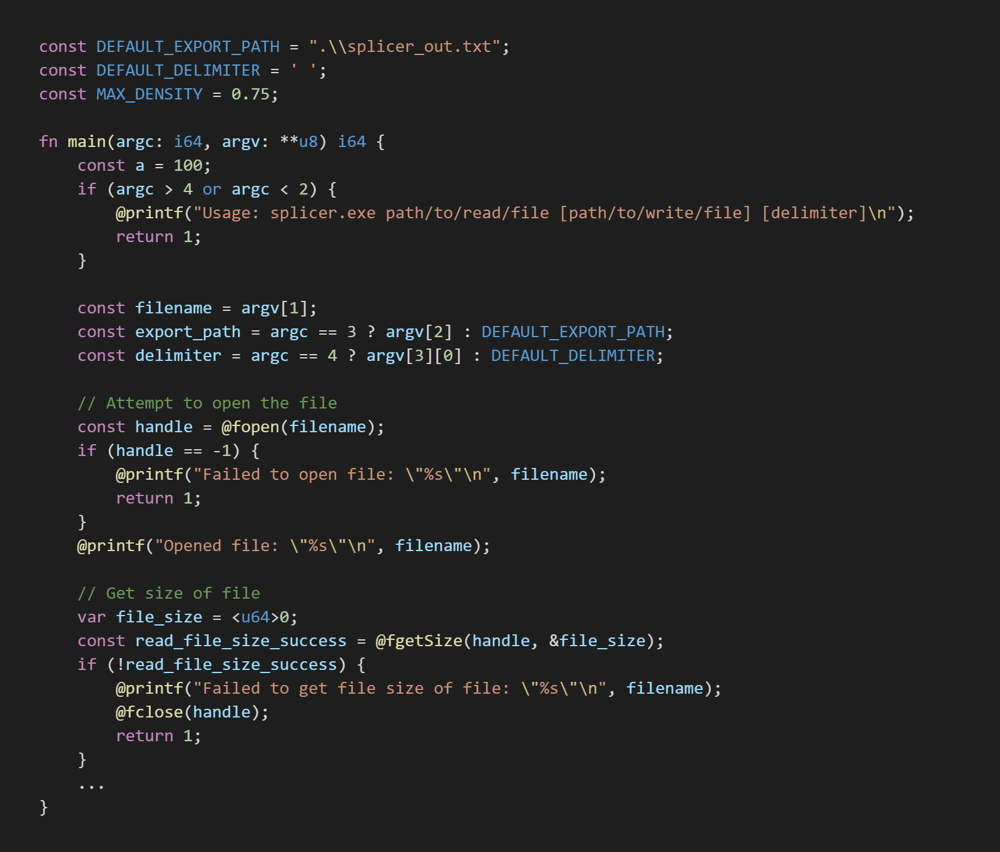

# What is Zav?
A custom compiler developed as a learning experiment for compiler design and the relatively new language Zig. Zav is a low-level language that supports functions and structs with methods, but requires manual memory management similar to C and Zig. The syntax is a cross between C and Zig, but has some novel features as well. There is limited interfacing available with operating systems through "native" function calls, but Zav is currently limited to the Windows platform as well as the x86 architecture. Zac supports type a simplified version of type inferencing, similar to zig and rust, making the process of writing code more streamlined. Zav uses multiple passes, allowing functions, structs, and globals to be declared at any location in the program while being usable anywhere else. This allows circular recursive function calls, circularly nested struct pointers, and several other conveniences.

Zav takes some inspiration from [Clox](https://craftinginterpreters.com/) by Robert Nystrom, but is a typed compiler unlike [Clox](https://craftinginterpreters.com/), which is a dynamically typed virtual machine.

# VS Code Extension
The 'zavlang.vscode' folder has a simple syntax highlighting extension for all .zav extension files.

Does not support more complex features like autocomplete 

# Dependencies
Will output a .asm file in NASM format without any dependencies, but will assume NASM and GCC are installed to path in order to output an exe file.

# Example
For an examples of a multimodule projects using all Zav has to offer, the examples folder is a good place to look.

The convolver example reads two wavefiles specified using command line arguments and outputs the convolution of those two files to a new wavefile,
optionally specified by a third command line argument.

This particular convolver implements a zero padded radix 2 (i)fft and multiplies the files in the frequency domain to reduce compute times.

The testing fold has many examples, some of which are outdated, that demonstrate the language's capabilities.

Splicer.zav is also good example of a simple script.

# Zav Language Grammar
### Notation:
- \* Means zero or more
- \+ Means one or more
- \? Means the prior token is optional 
- \| Means logical OR

## Common terms:

### **Identifier:** [_a-zA-Z] [_a-zA-Z0-9]*
  - A variable, function, method, or arguments identifier

### **Type/Kind:** Integer | Float | Pointer | Array | Function | Struct | Bool | Void
  - **Integer:** ("i" | "u") ("8" | "16" | "32" | "64")
    - "i" for signed integer; "u" for unsigned integer
    - The number after the signedness defines the number of bytes
  - **Float:** "f" ("32" | "64")
    - Only 32 bit and 64 bit IEEE floating point types are supported
  - **Pointer:** '*' "const"? **Type/Kind**
    - "const" is optional, defines if data can be mutated
    - Ex: *const u8 -> Points to a u8 that cannot be modified from this pointer, only accessed
    - Note: can be nested -> **i64 is a pointer to a pointer of a signed 64 bit integer
  - **Array:** '[' Length ']' "const"? **Type/Kind**
    - "const" is optional, defines if data can be mutated
    - Ex: [10]const u8 -> Is an array of length 10 of u8 values that cannot be modified by access from this array, only read
    - Note: can be nested -> [10][10]i64 is a 2d array of i64 values
  - **Function:** "fn" '(' **Type/Kind** (',' **Type/Kind**)* ')' **Type/Kind**
  - **Struct:** **Identifier** (note: must be declared using a StructStmt)
  - **Bool:** "bool"
    - Node: can be assigned with "true" or "false"
  - **Void:** "void"

### **Primative:** Integer | Float | Character | String | "true" | "false" | "nullptr" | **Identifier** | **NativeExpr**
  - **Integer:** [0-9]+
    - Defaults to i64
  - **Float:** [0-9]* '.' [0-9]*
    - Defaults to f64
  - **Character:** '\'' ASCII Character '\''
    - Results in a u8
  - **String;** '\"' ASCII Character* '\"'
    - Does not support multiline strings
    - Allows for escape sequences such as "Hello world!\n"

## What is in a program?
Zav currently does not support any form of modules or imports, so everything must be localized to one file. A file will be considered a **program**.

### **Program:** MainFunction (StructDeclaration | FunctionDefinition | GlobalDeclaration)*
  - **MainFunction:** "fn" main '(' **Identifier** ':' i64, **Identifier** ':' **u8 ')' "i64" BlockStmt
### **StructDeclaration:** "struct" '(' (Field | Method)+ ')'
  - **Field:** **Identifier** ':' **Type/Kind** ';'
  - **Method:** "fn" **Identifier** '(' Parameter (',' Parameter)? ')' BlockStmt
    - Every method must have a pointer to itself as the first parameter, though it can be a "const" or mutable reference with any valid identifier name
    - **Parameter:** **Identifier** ':' **Type/Kind**
      - Note: Parameters are immutable
### **FunctionDeclaration:** "fn" **Identifier** '(' ParamList? ')' BlockStmt
  - **ParamList:** **Parameter** (',' **Parameter**)*
### **GlobalDeclaration:** ("const" | "var") **Identifier** (':' **Type/Kind**)? '=' (Primative | "undefined") ';'
  - "undefined" is used to not initialize a variable while reserving space, only useful for "var" variables
  - The type definition is optional only if "undefined" is not used

## Statements: The building blocks

### **Declaration:** Statement | DeclarationStmt
  - **DeclarationStmt:** ("const" | "var") **Identifier** (':' **Type/Kind**)? '=' (Primative | "undefined") ';'
    - "undefined" is used to not initialize a variable while reserving space, only useful for "var" variables
    - The type definition is optional only if "undefined" is not used

### **Statement:** BlockStmt | MutationStmt | ReturnStmt | ContinueStmt | WhileStmt | ExpressionStmt | ReturnStmt | IfStmt

### **BlockStmt:** '{' Declaration* '}'
### **MutationStmt:** **Indentifier** [-+/*^&|]? '=' Primative ';'

